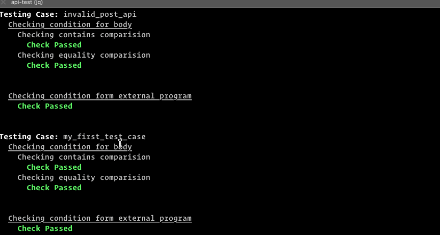

You can write automated integrated test using `api-test`. You write the tests in the same test case file under `expect` property. You can write tests for both `header` and `body`. See [Test cases properties](/api-test/test-file-definition#test-cases-attributes) to view all available properties.

## Checking Schemes

**Syntax:**

```json{4-21}
{
  "test_case_1": {
    "path": "/get_books",
    "expect": {
      "body": {
        "eq": {
          ...
        },
        "checking_scheme_2": {
          ...
        }
      },
      "header": {
        "checking_scheme_1": {
          ...
        },
        "checking_scheme_2": {
          ...
        }
      },
      "external": "your-program/script"
    }
    ...
  }
}
```

### Internal Checks

To make it simple and easy `api-test` provides 5 types of basic checking schemes:

- `eq` - Response should be exactly the same as expected
- `contains` - The expected value should be as subset of the response.
- `hasKey` - The key should be present in the JSON response
- `path_eq` - The value inside the nested object accessed by JSON path must be exactly the same.
- `path_contains` - The value inside the nested object accessed by JSON path must be a subset.

### External Checks

If the above checks don't meet your needs you can always inject `script` or `programs` to check complex comparisons inside `external` property inside `expect` block.

> You can specify all the above comparisons for a single test case.

Example:

```json
{
  "test_case_1": {
    "path": "/get_books",
    "expect": {
      "body": {
        "eq": {
          "id": "1",
          "author": "Subesh Bhandari",
          "title": "The Road to React",
          "category": ["programming", "js"],
          "meta": {
            "present": false,
            "years": [2019, 2020]
          }
        },
        "contains": {
          "id": 1,
          "category": []
        },
        "hasKey": ["id", "author", "category", "category.0", "category.1"],
        "path_eq": {
          "category[0]": "programming",
          "meta.present": false
        },
        "path_contains": {
          "category[0]": "programming",
          "meta.years": []
        }
      },
      "external": "node test.js"
    }
  }
}
```

## CI integration

You can integrate the tests in CI workflow.

### Success State

When all tests are successful it exits with status code `0`


### Failure State

When all some test or all tests fail it exits with status code `1`

