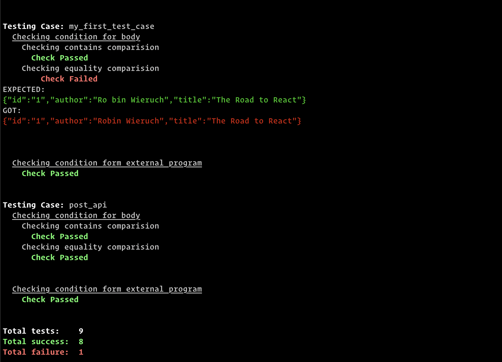

Light weight automated JSON API testing framework. Run API tests from the terminal.

<a class="github-button" href="https://github.com/subeshb1" data-color-scheme="no-preference: dark; light: dark; dark: dark;" data-show-count="true" aria-label="Follow @subeshb1 on GitHub">Follow @subeshb1</a> <a class="github-button" href="https://github.com/subeshb1/api-test" data-color-scheme="no-preference: light; light: light; dark: dark;" data-icon="octicon-star" data-show-count="true" aria-label="Star subeshb1/api-test on GitHub">Star</a>
 

## Organize your test cases in a JSON file

```json
{
  "testCases": {
    "my_first_test_case": {
      "path": "/books",
      "query": {
        "id": 1
      },
      "method": "GET"
    }
    ...
  },
  "url": "my-api.com"
}
```

## Call APIs

```sh
api-test run my_first_test_case # Run single test case
api-test run all                # Run all test cases simultaneously
```


## Add automated integration tests

Run the same tests in `development`, `staging` and `production` environment automatically.

In JSON file:

```json{10-21}
{
  "testCases": {
    "my_first_test_case": {
      "path": "/books",
      "query": {
        "id": 1
      },
      "method": "GET"
    },
    "expect": {
      "body": {
        "eq": {
          "id": "1",
          "author": "Robin Wieruch",
          "title": "The Road to React"
        },
        "contains": {
          "id": "1"
        },
        "hasKey": ["id", "author", "title"]
      }
    }
  },
  "url": "my-api.com"
}
```

Run automated test:

```sh
api-test test my_first_test_case
```

Result:


## Compatible with CI Workflow

Integrate automated tests in CI workflow.


