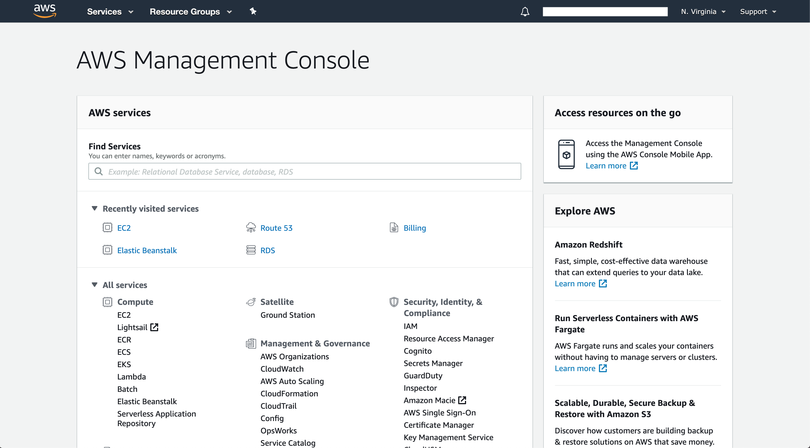

## TODO: Describe Cloud Computing a little

- Definition
- Characteristics

## TODO: AWS Brief

## Ways to use AWS

There are three ways to access and use AWS:

### 1. AWS Management Console{#aws-management-console}

It provides Graphical Interface to access AWS services and features via web. You can access the console by clicking the link [AWS Management Console](https://aws.amazon.com/console/) after signing up on AWS. It provides the following benefits:

- Easy navigation to all the AWS services and features.
- Easy to use for both beginners and experts.
- Convenient mobile app in IOS and android, for easy monitoring of services.



### 2. Command Line Interface (CLI){#command-line-interface}

Allows access to AWS services via discrete commands from the command line. In order to setup AWS CLI follow the instruction from [AWS Command Line Interface](https://aws.amazon.com/cli/). It provides the following benefits:

- Flexibility to create scripts and automate and repeat the deployment of AWS resources and services.
- Programming language agnostic.

```sh
$ aws ec2 describe-instances
{
    "Reservations": []
}
```

The above command lists out EC2 instances in your account, which we will be discussing in upcoming blogs.

### 3. Software Development Kits (SDKs){#software-development-kits}

It incorporates the connectivity and functionality of the wide range of AWS Cloud services into different programming languages which you can checkout from [Tools to Build on AWS](https://aws.amazon.com/tools/). It provides the following benefits:

- Ability to use AWS in existing application
- Flexibility to create application

```go
package main

import (
        "fmt"
        "context"
        "github.com/aws/aws-lambda-go/lambda"
)

type MyEvent struct {
        Name string `json:"name"`
}

func HandleRequest(ctx context.Context, name MyEvent) (string, error) {
        return fmt.Sprintf("Hello %s!", name.Name ), nil
}

func main() {
        lambda.Start(HandleRequest)
}
```

The above go-lang code uses [AWS lambda](https://aws.amazon.com/lambda/).

## Conclusion

We have discussed briefly about Cloud Computing, Amazon Web Services(AWS) and the ways we can use AWS. We will be diving deep into AWS core services in the upcoming blogs and build a simple application using those services.
