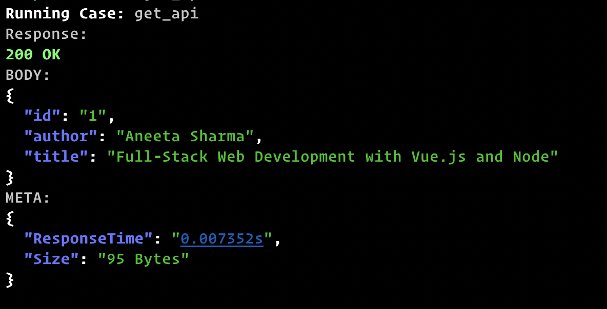
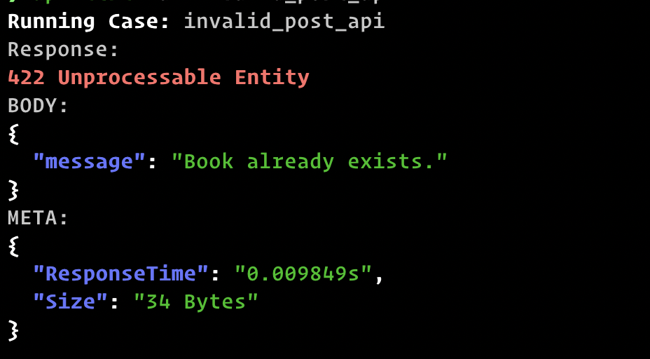
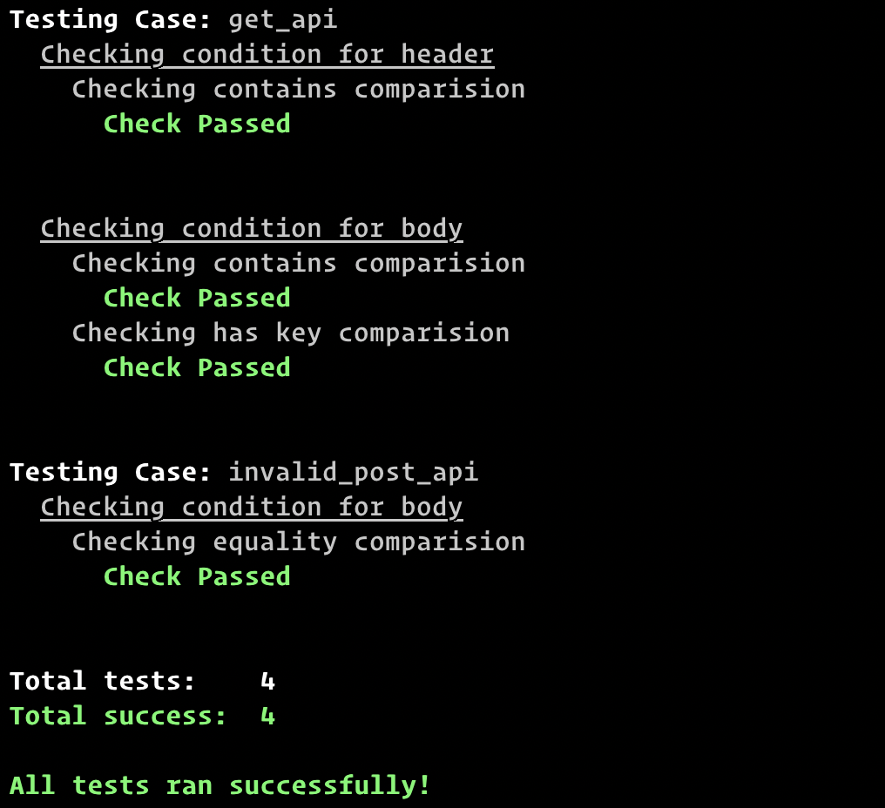
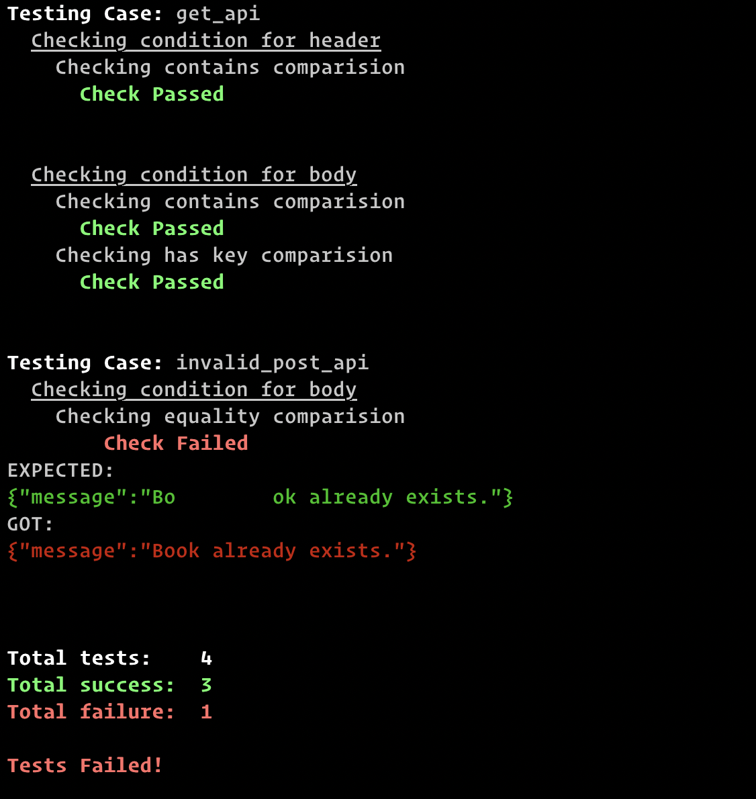

See [Installing api-test](/api-test/installation) before moving to next steps.

## Creating a test file

The main principle is to define your API test cases in a JSON file and perform tests on them. A sample test case definition will look something like this:

```json
{
  "testCases": {
    "get_api": {
      "path": "/books",
      "query": {
        "id": "1"
      }
    },
    "post_api": {
      "path": "/books",
      "method": "POST",
      "body": {
        "author": "John Doe",
        "title": "My Book 5"
      }
    },
    "invalid_post_api": {
      "path": "/books",
      "method": "POST",
      "body": {
        "author": "Shawn Doe",
        "title": "My Book 8"
      }
    }
  },
  "url": "localhost:3000",
  "header": {
    "Content-Type": "application/javascript"
  }
}
```

There are two main components in the test file:

- **testCases**: This object will hold all the test case information where each test case is identified by a unique key.
- **url**: The base URL of the API endpoint.

The root header property stores the common headers like Authorization, Content-Type, etc and are injected across all test cases. You can also specify headers in individual test cases.
You can have path,body, header,query and method in a test case. Additional property expect is also available for automated tests which we will be discussing later.

## Calling the API route

Now let’s call our first API route. To run a test case, we have a command named `run`. It takes the test case key as an argument.

> Note: Test file should be provided as well

```sh
api-test -f test.json run get_api
```

This will generate the following output:


Now, let’s try out the case where it returns `4xx` response.

```sh
api-test -f test.json run invalid_post_api
```



You can also call multiple API routes at once,

```sh
api-test -f test.json run get_api post_api
# or
api-test -f test.json run all # to run all the cases
```

If you also want the header information you can pass in -i as a flag. See more use cases by running `api-test -f test.json run --help`.

## Automated tests

api-test also supports writing automated tests using 5 types of basic comparisons on header and body of the response:

- eq - The response should be exactly the same as expected.
- contains - The expected value should be a subset of the response.
- hasKey - The key should be present in the JSON response.
- path_eq - The value inside the nested object accessed by the JSON path must be the same.
- path_contains - The value inside the nested object accessed by the JSON path must be a subset.

Let’s add some tests to be more clear:

```json
{
  "testCases": {
    "get_api": {
      "path": "/books",
      "query": {
        "id": "1"
      },
      "expect": {
        "body": {
          "contains": {
            "author": "Aneeta Sharma"
          },
          "hasKey": ["id", "author", "title"]
        },
        "header": {
          "contains": {
            "http_status": "200"
          }
        }
      }
    },
    "invalid_post_api": {
      "path": "/books",
      "method": "POST",
      "body": {
        "id": "1",
        "author": "Robin Wieruch",
        "title": "The Road to React"
      },
      "expect": {
        "body": {
          "eq": { "message": "Book already exists." }
        }
      }
    }
  },
  "url": "localhost:3000",
  "header": {
    "Content-Type": "application/javascript"
  }
}
```

The tests are written in expect property of each test case and checks can be made for both header and body response.

In the response body of get_api we know the response will contain a property author and with value Aneeta Sharma we add a contains check to match the subset. Similarly, for the values which are dynamic, we can check if the key is present using hasKey check.
For the invalid response, we know the response as it is expected to be static. So, we can have an equality check using eq . The eq the check will compare all the object value irrespective of the key order.

The checks `path_eq` and `path_contains` are similar to the ability to make comparisons at any depth of a JSON object. See the [docs](https://subeshbhandari.com/api-test) for more information.

Now, let’s see the tests in action!

To run a test case the command test is used.

```sh
api-test -f test.json test get_api
# or
api-test -f test.json test all
```



Now let’s break the test to ensure it is working correctly. I will alter the eq check for invalid_post_api by adding extra spaces in the text.

```json
"eq": { "message": "Bo        ok already exists." }
```



Great! Now we know that our earlier tests were running properly.
If the available checks don’t match your need, api-test also provides a way to inject a script or program written in any language to check and compare values.

To do so, provide the executable you want to run in external the property of expect block. Below is the example using node js.

```json
{
  ...
  "expect": {
    "body": {...},
    "header": {...},
    "external": "node test.js"
  }
}
```

And write the comparison file as:

```js
let testCase = process.argv[2]; // First arg will be test case key
let body = process.argv[3]; // Second arg will be body
let header = process.argv[4]; // Third arg will be header

let success = true;
switch (testCase) {
  case "get_api":
    if (success) {
      process.exit(0); // For success case
    } else {
      process.exit(1); // For failure case
    }
    break;
  case "invalid_post_api":
    ...
    break;

  default:
    break;
}
```

The program should exit with code 0 on success and code > 0 to communicate failure.
Now, you can perform any type of comparison you like!
When the development is completed, we can change the variables in the test file and start running the automated tests in the staging or production environment. Just be sure you don’t run an update or create a request on critical data. The automated tests can also be integrated into the CI workflow. When all tests pass it exits with code 0 and when some or all tests fail it exits with code 1.

## Conclusion

If you are testing private APIs or only have access to the terminal, api-test is a tool for you. You can structure test cases in a JSON file, write automated tests, and run the same test cases in all the environments without having to worry about anything. It will help ease out the testing process from development to production removing manual checks.
