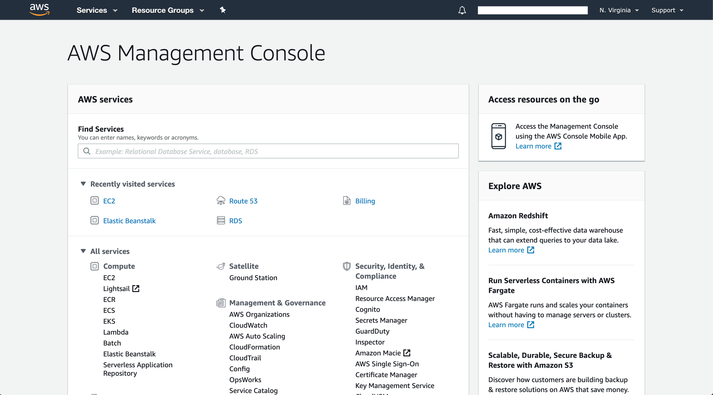
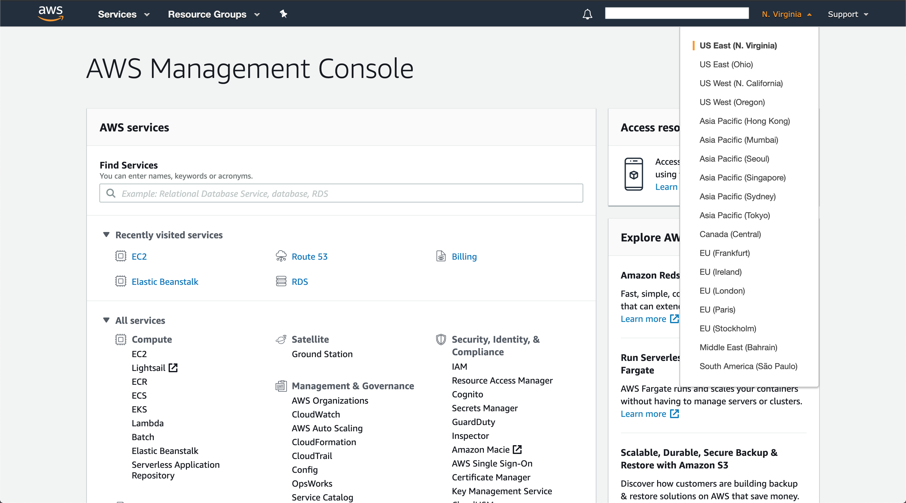
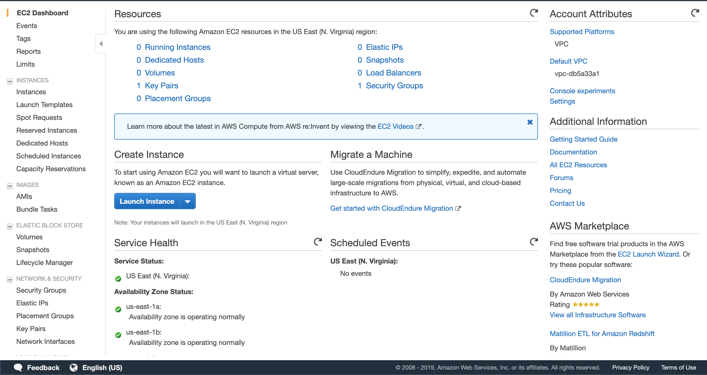

This blog/tutorial covers step by step process to create an Amazon EC2 instance. To learn more about EC2 instance and other Amazon core services checkout my previous blog [AWS Core Services](/aws/aws-core-services#elastic-cloud-compute-ec2).

## Step 1: Login to AWS Console

AWS provides [3 ways to use its services](/aws#ways-to-use-aws). For this tutorial we'll use the [AWS management Console](/aws#aws-management-console) to create an EC2 instance. Login in via [AWS Management Console](https://aws.amazon.com/console/) after signing up on AWS. Then you will see the page as below:

## Step 2: Choose a region

On the top-right corner you'll be able to see and select different regions where you want to host your EC2 instance.

For this tutorial **US East (N. Virginia)** region will be used. You can select whichever region you like.

## Step 3: Launch EC2 wizard
Click on services and search for EC2 or go to [EC2 Dashboard](https://console.aws.amazon.com/ec2/v2/home) and click on Launch Instances.

## Step 4: Select an AMI (Software)

## Step 5: Select instance type (Hardware)

## Step 6: Configure Network

## Step 7: Configure Storage

## Step 8: Configure Key Pairs

## Step 9: Launch and Connect

## Step 9:
