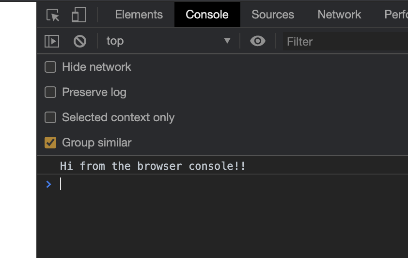

> **TL;DR** This blog illustrates how you can import your existing go code to Wasm, and run it in the browser. In this blog I will show you how I made a tool to convert Image to Ascii characters on the browser that was written in Go. Link to the **Github repo:** [wasm-go-image-to-ascii](https://github.com/subeshb1/wasm-go-image-to-ascii). Here is the **Demo:** [Image to Ascii](https://subeshbhandari.com/app/wasm/image-to-ascii/)

## What is WebAssembly?

Before moving on to writing the code, let's first understand what WebAssembly is. WebAssembly or WASM is an assembly-like language that can run in near native performance in the browser. It is not to be written manually but to be treated as a compilation target for languages such as C/C++, Golang, Rust, .Net etc. This means first we write a program in a language, then convert it to WASM and then run it in the browser. This will allow the program to run in near native speed and give the ability to run program written in any language to run on the browser. You can create web applications in the language you are familiar with. It doesn't meat it will totally remove javascript but exist hand in hand with JavaScript. The list of languages that support WASM compilation are in [awesome-wasm-langs](https://github.com/appcypher/awesome-wasm-langs) and more info on WebAssembly: https://webassembly.org/

## Running go on the browser

Now, let's get our hands dirty with some basic WASM and Golang.

### Writing Go Code

Let's write our first hello world program.

```go
package main

import "fmt"

func main() {
    fmt.Println("Hi from the browser console!!")
}
```

### Compiling to WebAssembly

Let's compile it to Wasm.

```sh
GOOS=js GOARCH=wasm go build -o main.wasm
```

This will create a `main.wasm` WebAssembly file that we can import and run on the browser.

### Integrating with javascript

After we write our Go code and compile it to WASM we can then start integrating it on the browser.

We will need a Go runtime wrapper written in javascript to interact with Go through wasm. The code is shipped with Go 1.11+ and can be copied using the following command:

```sh
    cp "$(go env GOROOT)/misc/wasm/wasm_exec.js" .
```

Now, let's integrate it to the browser.

```html
<html>
  <head>
    <meta charset="utf-8" />
    <script src="wasm_exec.js"></script>
    <script>
      const go = new Go()
      WebAssembly.instantiateStreaming(
        fetch('main.wasm'),
        go.importObject
      ).then(result => {
        go.run(result.instance)
      })
    </script>
  </head>
  <body></body>
</html>
```

`WebAssembly.instantiateStreaming` compiles and instantiates WebAssembly code. After the code is instantiated, we will run the Go program with `go.run(result.instance)`. For more information visit the [WebAssembly.instantiateStreaming](https://developer.mozilla.org/en-US/docs/Web/JavaScript/Reference/Global_Objects/WebAssembly/instantiateStreaming) docs and [Go WebAssembly](https://github.com/golang/go/wiki/WebAssembly).
Now if we run a server to serve the content we can view the output in browser console.

> The mime type for `.wasm` file should be `application/wasm` when served from the server.

We can use [`goexec`](https://github.com/shurcooL/goexec#goexec) to serve the files:

```sh
# Install go exec
go get -u github.com/shurcooL/goexec

# Start the server at 8080 port
goexec 'http.ListenAndServe(`:8080`, http.FileServer(http.Dir(`.`)))'
```

If we open `localhost:8080` on the browser and open the console we will see the our message sent from Go:


## Accessing Web APIs and exposing Go functions


## Passing Values to WebAssembly

## Passing Values to WebAssembly

## Conclusion
